# ドキュメント
## ドキュメント一覧
- コンテキストマップ([contextmap.drawio.svg](contextmap.drawio.svg))
    - 構築するサービス(コンテキスト)の関係を表した図
- ER図([er.drawio.svg](er.drawio.svg))
    - 各コンテキスト内のエンティティの関係を表した図

## コンテキストマップ

## ER図

